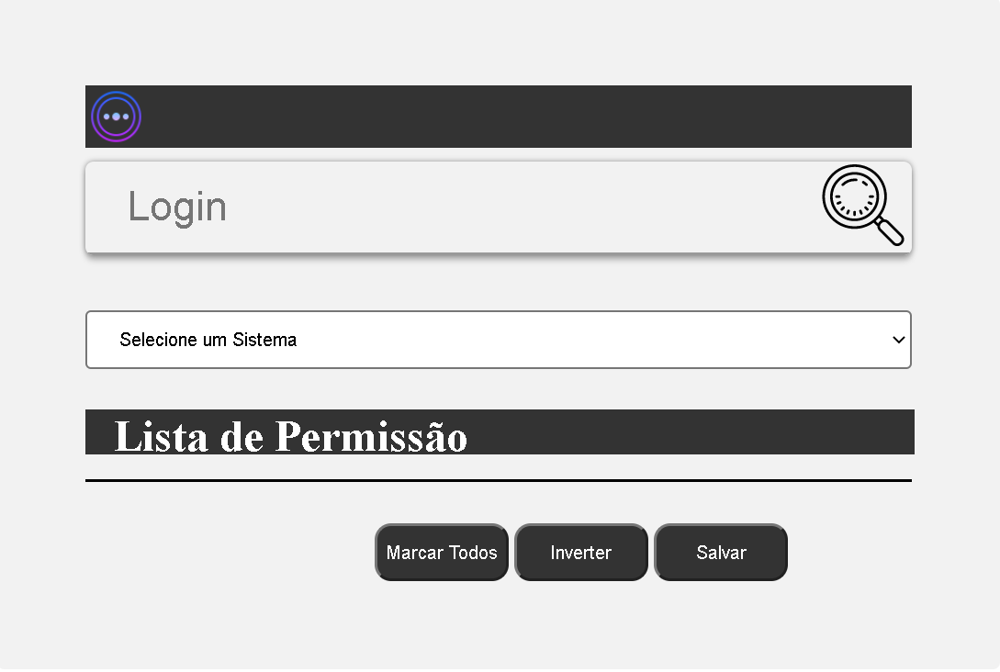
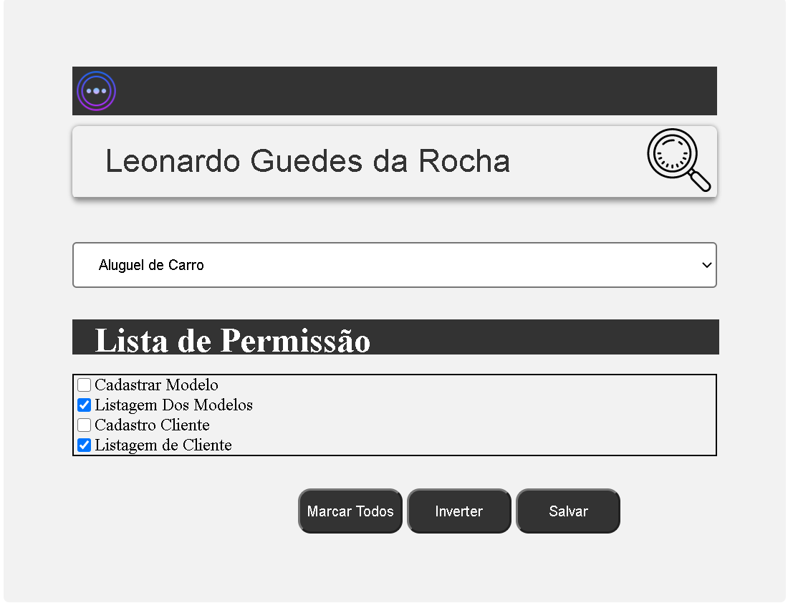

# Securtiy Solution

  <a href="#tecnologias">Tecnologias</a>&nbsp;&nbsp;&nbsp;|&nbsp;&nbsp;&nbsp;
  <a href="#projeto">Projeto</a>&nbsp;&nbsp;&nbsp;|&nbsp;&nbsp;&nbsp;
  <a href="#layout">Layout</a>&nbsp;&nbsp;&nbsp;|&nbsp;&nbsp;&nbsp;
  <a href="#memo-licença">Licença</a>

# Tecnologias

Esse teste foi desenvolvido com as seguintes tecnologias

    -[HTML5]()
    -CSS
    -JAVASCRIPT 

## Projeto
  <strong>Securtiy Solution</strong>
   È um aplicação Web services , ultizando microServices com MDA(Modelo minimalista em relação as camadas).

## Layaout
<h1>Securtiy Solution</h1>
    <h1 align="center">
        
         
    </h1>

## :memo: Licença

Esse projeto está sob a licença MIT. Veja o arquivo [LICENSE](LICENSE.md) para mais detalhes.

<h4 align="center">
    Feito com 💜 by <a href="https://www.linkedin.com/in/leonardo-guedes-95a016108/" target="_blank">Leonardo Guedes da Rocha</a>
</h4>